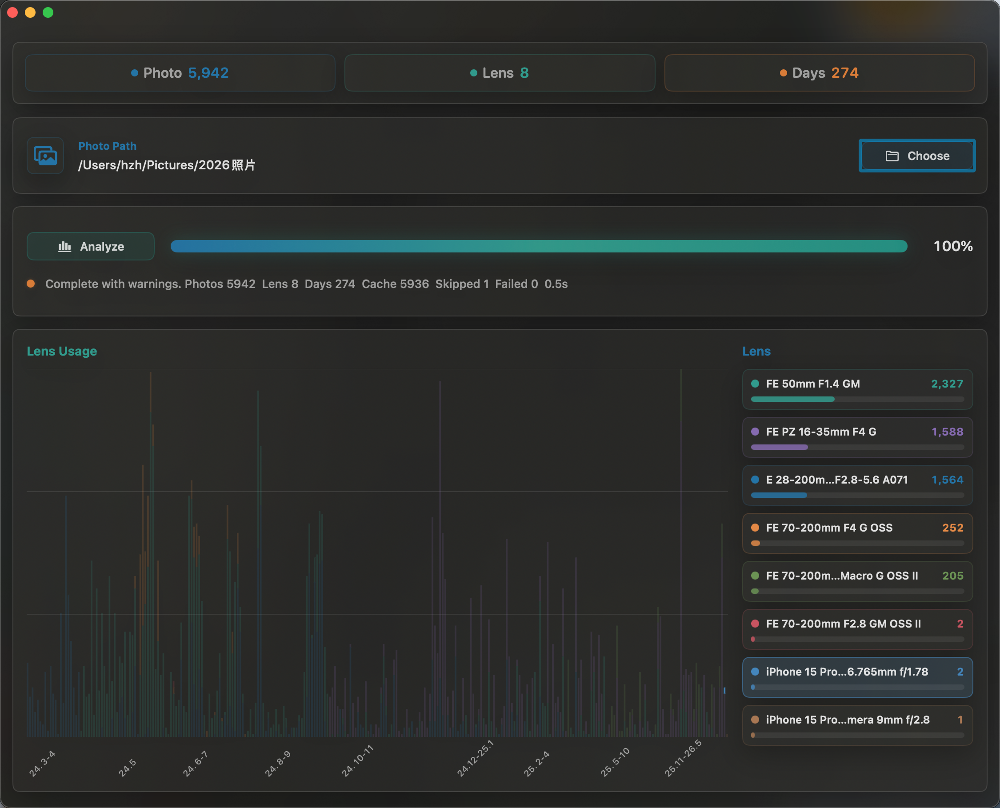
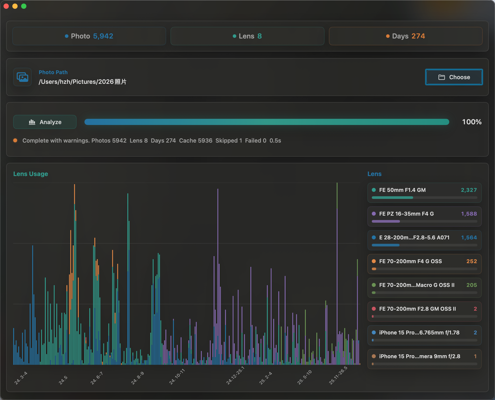

# AnalysisLens

AnalysisLens 是一个原生 macOS SwiftUI 工具，用来从照片 EXIF 信息中统计镜头/设备使用频率，并按拍摄日期生成可交互的镜头使用图表。

它来自原 Python 脚本 `Analysis_镜头使用频率.py` 的 Swift 版本迁移：保留递归扫描、读取 `DateTimeOriginal`、读取镜头信息、按日期聚合的核心逻辑，同时提供 macOS 毛玻璃风格界面。

## Screenshots





## Features

- 递归扫描照片目录，支持 `jpg`、`jpeg`、`png`、`heic`、`heif`、`tif`、`tiff`。
- 读取 EXIF `DateTimeOriginal` / `DateTimeDigitized`，必要时回退 TIFF `DateTime`。
- 读取 EXIF `LensModel` 并按镜头统计。
- iPhone / iPad 照片按设备型号归类，例如 `iPhone 15 Pro`，不再按手机焦段拆分。
- 按日期绘制堆叠柱状图，按镜头显示总量排行。
- 点击右侧镜头列表可高亮左侧图表中对应镜头，其余镜头自动变暗；点击空白处取消高亮。
- X 轴按英文月份分组，空间不足时自动合并月份范围。
- 自动跟随 macOS 浅色/深色模式。
- 使用 `Canvas` 绘制大图表，减少大量 SwiftUI 节点导致的卡顿。
- 缓存照片元数据，重复分析同一批照片时会复用有效缓存。

## Default Path

启动时默认照片目录按当前年份生成：

```text
~/Pictures/<year> 照片
```

如果带空格目录不存在，但无空格目录存在，则自动使用：

```text
~/Pictures/<year>照片
```

例如 2026 年默认优先使用：

```text
/Users/hzh/Pictures/2026 照片
```

## Requirements

- macOS 12.0 或更新版本。
- Apple Silicon Mac。当前 Makefile 默认构建 `arm64`。
- Xcode Command Line Tools，提供 `swiftc` 和 macOS SDK。

## Build

开发构建：

```sh
make app
```

生成的 app bundle 位于：

```text
build/AnalysisLens.app
```

发布构建：

```sh
make dist CONFIG=release
```

发布包位于：

```text
dist/AnalysisLens.app
```

清理构建产物：

```sh
make clean
```

清理 Swift 模块缓存：

```sh
make clean-cache
```

## Run

```sh
make run
```

也可以直接打开：

```text
build/AnalysisLens.app
```

## Cache

Swift 模块缓存保存在项目内：

```text
.build-cache/module-cache
```

照片 EXIF 元数据缓存保存在用户缓存目录：

```text
~/Library/Caches/AnalysisLens/lens-metadata-cache-v2.json
```

缓存按文件路径、文件大小和修改时间校验。照片发生变化时会重新读取 EXIF。

## Version

Current version: `v1.0.0`
