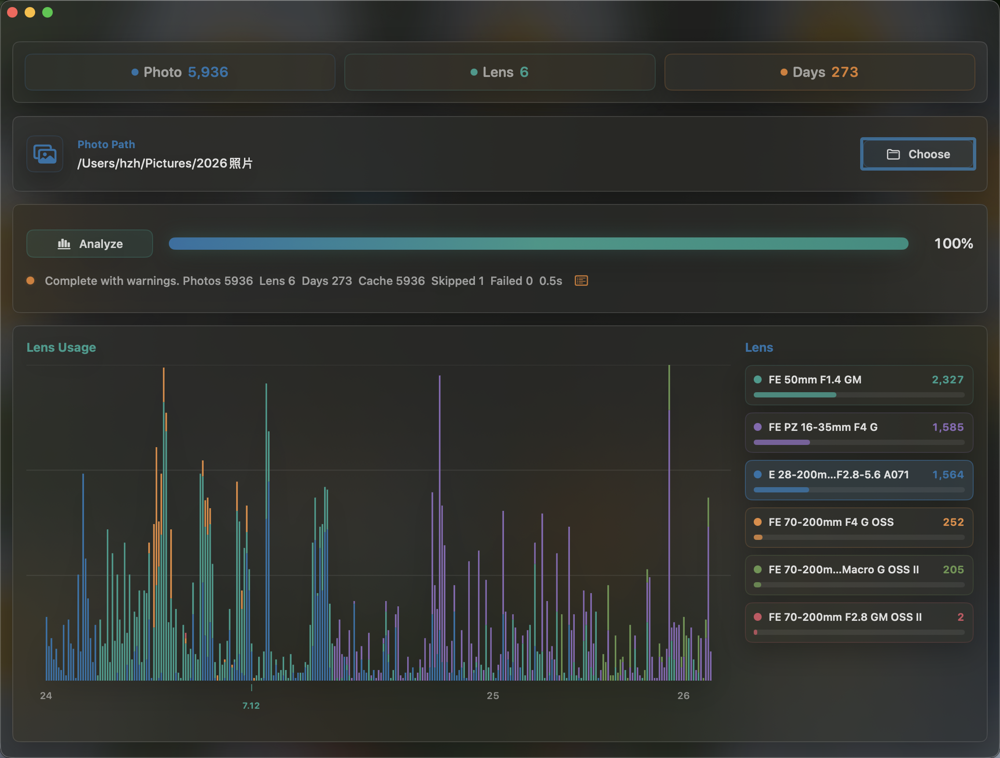
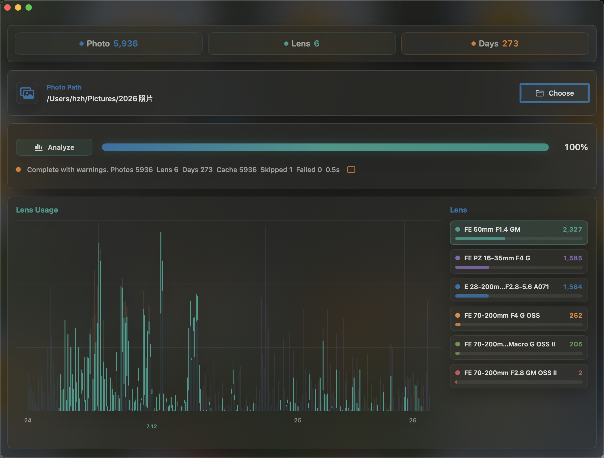
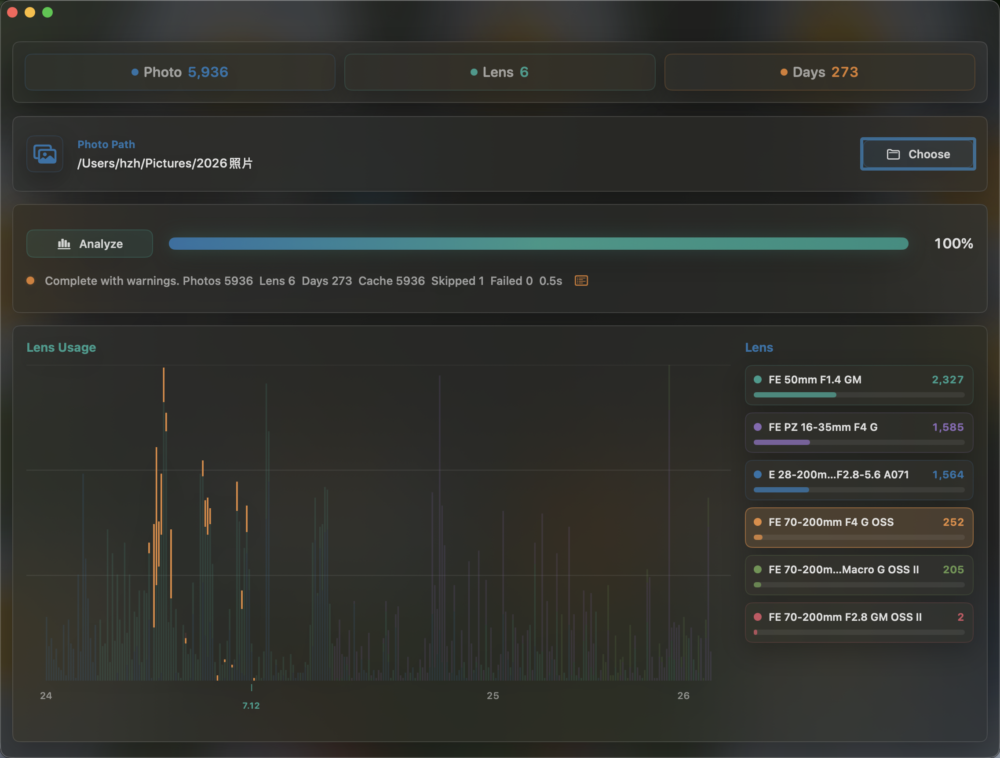
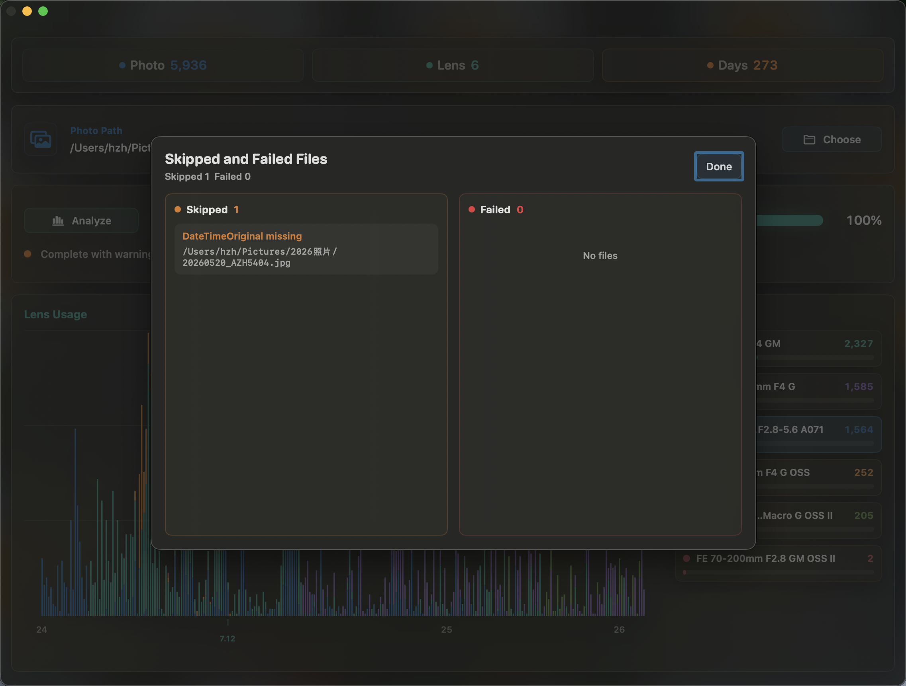

# AnalysisLens

AnalysisLens 是一个原生 macOS SwiftUI 工具，用来从照片 EXIF 信息中统计镜头/设备使用频率，并按拍摄日期生成可交互的镜头使用图表。递归扫描照片目录并缓存，支持 `jpg`、`jpeg`、`png`、`heic`、`heif`、`tif`、`tiff`。自动跟随 macOS 浅色/深色模式。

## Screenshots

### 可视化日期

点击图表中的某一天后，X 轴会在对应柱子下方显示当天日期。

### 主界面

主界面包含照片目录、分析进度、统计摘要、镜头使用图表和镜头排行。

### 高亮镜头

点击右侧镜头列表后，左侧图表会突出对应镜头，其余镜头自动变暗。

### 异常图片具体信息查看

点击状态行的列表图标后，可以查看 skipped / failed 文件的具体路径和原因。

## Requirements

- macOS 12.0 或更新版本。
- Apple Silicon Mac。当前 Makefile 默认构建 `arm64`。
- Xcode Command Line Tools，提供 `swiftc` 和 macOS SDK。

## Version

Current version: `v1.2.0`
